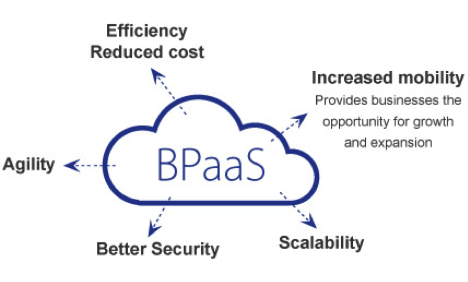

## NAMA : FELIX JEFRIAN FERY F
## NIM  : 175410038
## KELAS: TEKNIK

## Business Process as a Service
Pengertian Business Process as a Service

Proses Bisnis sebagai Layanan (BPaaS) adalah setiap jenis proses bisnis horizontal atau vertikal yang disampaikan berdasarkan model layanan awan. Layanan awan ini - yang meliputi Software sebagai Service (SaaS), Platform sebagai Layanan (PaaS), dan Infrastructure as a Service (IaaS) - karena itu tergantung pada layanan terkait. 

Perusahaan telah mengotomatisasi proses bisnis selama beberapa dekade. Awalnya, mereka dipaksa untuk melakukannya secara manual atau pemrograman. Sebagai contoh, jika sebuah perusahaan ingin memastikan bahwa sistem manajemen untuk pesanan mendongak pemeriksaan kredit sebelum mengeluarkan transaksi, perusahaan membangun bahwa permintaan ke dalam program. 

Dalam beberapa kasus, seluruh proses bisnis outsourcing perusahaan mungkin menerapkan proses secara manual atau melalui otomatisasi. Dengan munculnya komputasi awan, pendekatan ini mulai berubah. Semakin, perusahaan sedang melihat pendekatan berorientasi-layanan yang lebih kepada pelayanan. Daripada berasumsi bahwa Anda perlu paket aplikasi yang meliputi logika bisnis, data, dan proses, itu mungkin untuk memilih aplikasi proses yang tidak terikat ke satu aplikasi.

## Apa Proses Bisnis Sebagai Layanan (BPaaS) di Cloud Computing?

Proses Bisnis Sebagai Layanan (BPaaS) adalah jenis proses bisnis horizontal atau vertikal yang disampaikan berdasarkan model layanan awan. Layanan awan ini - yang mencakup Perangkat Lunak sebagai Layanan (SaaS), Platform sebagai Layanan (PaaS), dan Infrastruktur sebagai Layanan (IaaS) - oleh karena itu bergantung pada layanan terkait.

Perusahaan telah mengotomatisasi proses bisnis selama beberapa dekade. Awalnya, mereka terpaksa melakukannya secara manual atau pemrograman. Misalnya, jika perusahaan ingin memastikan bahwa sistem manajemen untuk pesanan mendongak cek kredit sebelum mengeluarkan transaksi, perusahaan membuat permintaan itu ke dalam sebuah program.

 
Dalam beberapa kasus, seluruh proses bisnis perusahaan outsourcing dapat menerapkan proses secara manual atau melalui otomasi. Dengan dimulainya komputasi awan, pendekatan ini mulai berubah. Semakin banyak perusahaan melihat pendekatan layanan yang berorientasi pada layanan. Alih-alih menganggap Anda memerlukan aplikasi paket yang mencakup logika bisnis, data, dan proses, mungkin saja Anda memilih aplikasi proses yang tidak terkait dengan satu aplikasi.

 
Ada alasan praktis untuk memilih layanan proses bisnis. Pertama, organisasi dapat memilih proses yang sesuai dengan kebijakan bisnis. Ini kemudian dapat digunakan di banyak lingkungan aplikasi yang berbeda. Ini memastikan bahwa proses yang konsisten dan pasti, yang konsisten ada di seluruh organisasi. Misalnya, perusahaan mungkin memiliki proses yang kompleks untuk memproses gaji atau mengelola pengiriman. Layanan ini dapat dihubungkan ke layanan lain di awan, seperti SaaS, dan juga aplikasi di pusat data.

 
Seperti layanan awan SaaS, proses bisnis mulai dirancang sebagai penawaran kemasan yang dapat digunakan dengan cara hibrida. Bagaimanapun, proses bisnis adalah langkah yang Anda ambil atau aktivitas yang Anda lakukan untuk memfasilitasi penyampaian produk atau layanan kepada pelanggan atau pemangku kepentingan Anda. Proses bisnis ini benar-benar bisa menjadi layanan yang bisa dilakukan secara otomatis, termasuk mengelola e-mail, mengirimkan paket, atau mengelola kredit pelanggan.

Perbedaan antara aplikasi kemasan tradisional dan BPaaS adalah bahwa BPaaS dirancang untuk berorientasi pada layanan. Jadi, BPaaS cenderung memiliki antarmuka yang terdefinisi dengan baik. Selain itu, BPaaS adalah layanan standar untuk digunakan oleh banyak organisasi yang berbeda. Karena layanan ini jauh lebih optimal untuk memberikan layanan secara konsisten, mereka dapat memanfaatkan otomasi, standarisasi, dan pengulangan dalam cara layanan digunakan dan dikirimkan.

Karakteristik berikut menentukan BPAaS:

BPaaS duduk di atas tiga layanan awan pendiri lainnya: SaaS, PaaS, dan IaaS.

Layanan BPaaS dapat dikonfigurasi berdasarkan proses yang sedang dirancang.

Layanan BPaaS harus memiliki API yang terdefinisi dengan baik sehingga mudah dihubungkan ke layanan terkait.

BPaaS harus dapat mendukung banyak bahasa dan beberapa lingkungan penerapan karena bisnis tidak dapat memprediksi bagaimana proses bisnis akan dimanfaatkan di masa depan.

Lingkungan BPaaS harus bisa menangani skala besar. Layanan harus bisa pergi dari pengelolaan beberapa proses untuk beberapa pelanggan untuk dapat mendukung ratusan bahkan ribuan pelanggan dan proses. Layanan ini mencapai tujuan tersebut dengan mengoptimalkan layanan awan yang mendasari untuk mendukung jenis elastisitas dan penskalaan ini.

## Contoh Penyedia Layanan BPaaS

1. http://www.wipro.com/
menyediakan Layanan Bpaas :
- Business process outsourcing (http://www.wipro.com/services/business-process-outsourcing-BPO-services/)
- Infrastructure Management services (http://www.wipro.com/services/infrastructure-management-services/)
- Analytics information And management ( http://www.wipro.com/services/analytics-information-management/)

2. http://www.cognizant.com/
menyediakan Layanan Bpaas :
- Research And analytics
  Menyediakan layanan yg terdiri dari  Financial Research, Business/Market Research,etc 
- Finance and accounting
  Menyediakan layanan yg terdiri dari Customized Services, etc
- Vertical Markets 
   Menyediakan layanan yg terdiri dari Banking and Financial Services , Insurance, Life Sciences, etc

3. http://gartnerevent.com/
menyediakan Layanan Bpaas : 
-  Gartner Consulting (http://www.gartner.com/technology/consulting/)
-  Research Products and Services (http://www.gartner.com/technology/research.jsp
-  Vendor Briefings (http://www.gartner.com/technology/about/vendor_briefings.jsp)