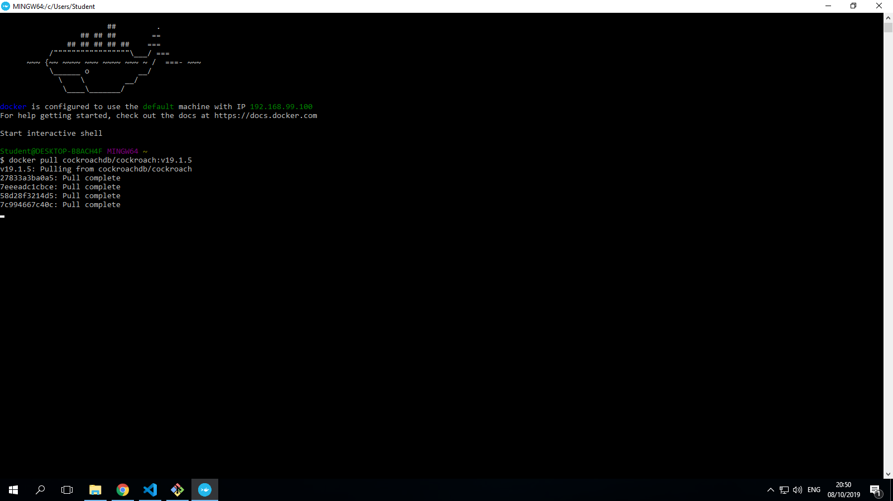

### NAMA  :  FELIX JEFRIAN FERY F
### NIM   :  175410038
### KELAS :  TI-9

## CockroachDB

## INSTALL
1. Install Docker for Windows.

Docker for Windows requires 64bit Windows 10 Pro and Microsoft Hyper-V. Please see the official documentation for more details. Note that if your system does not satisfy the stated requirements, you can try using Docker Toolbox.

2. Open PowerShell and confirm that the Docker daemon is running in the background:

COPY 
PS C:\Users\username> docker version
If you do not see the server listed, start Docker for Windows.

3. Share your local drives. This makes it possible to mount local directories as data volumes to persist node data after containers are stopped or deleted.

4. Pull the image for the v19.1.5 release of CockroachDB from Docker Hub: COPY 
PS C:\Users\username> docker pull cockroachdb/cockroach:v19.1.5

### INSTALL COMPLETE

## CONFIGURASI

## MEMBUAT DATABASE

## MEMBUAT TABEL

## MENGISI DATA

## QUERY DATA