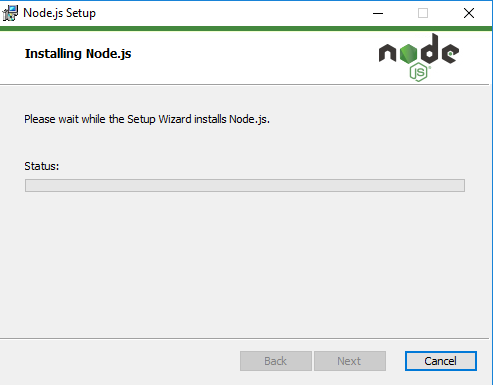

## TCC
# NAMA  : FELIX JEFRIAN FERY F
# KELAS : TI-9
# NIM   : 175410038

ZEIT Now adalah platform cloud untuk situs statis dan Fungsi Tanpa Server. Ini memungkinkan pengembang untuk meng-host situs web dan layanan web yang digunakan secara instan, skala secara otomatis, dan tidak memerlukan pengawasan, semua tanpa konfigurasi.

 1. Login ZEIT menggunakan github
 

 2. Install Now CLI
 
 
 
 
 
 
 
 

 Jalankan program yang tersedia
 
 
 

 ## Creating a Project and Deploying

 1. Anda dapat membuat aplikasi Next.js baru dengan perintah berikut menggunakan npm atau Yarn:
 Masukkan :
 
 

 2. kemudian gunakan aplikasi Anda dengan satu perintah di terminal Anda:
 
 