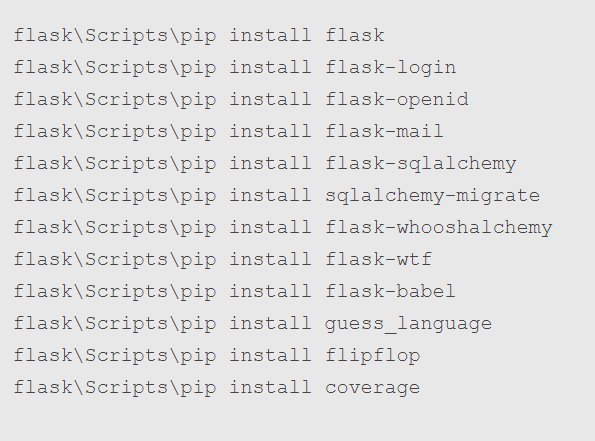
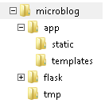
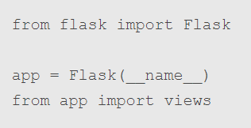
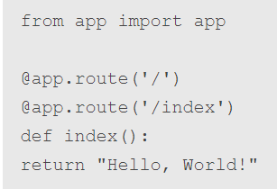
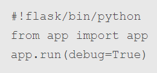
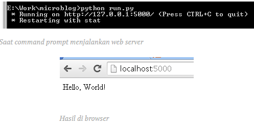
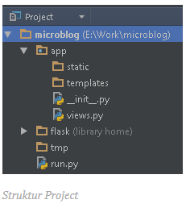

## NAMA : FELIX JEFRIAN FERY F
## NIM  : 175410038
## KELAS: TEKNIK INFORMATIKA - 9

Instalasi Python dan Flask Bagian I: Hello World
1. Instalasi Flask
Langkah pertama untuk menginstall Dlask adalah pastikan python sudah terinstall. Kalau belum, silakan diinstall terlebih dahulu.

Kemudian kita akan menginstall framework Flask dan beberapa extensionnya. Supaya lebih mudah, kita bisa membuat sebuah virtual environment dan menginstall Flask di sana. Sekarang kita buat satu folder untuk mengerjakan project kita, misalnya kita sebut microblog. Kenapa? karena kita akan membuat microblog. Nah selanjutnya, kita harus menginstall virtualenv terlebih dahulu.

untuk Windows ini agak berbelit-belit. Pertama, kita harus menginstall pip, bisa mengikuti instruksi di sini. Jika sudah menginstall pip, maka masukkan perintah ini untuk menginstall virtualenv:
# pip install virtualenv

Setelah kita menginstall virtualenv, sekarang kita buka terminal/shell (atau command prompt bagi pengguna Windows), kemudian masuk ke folder microblog yang sudah dibuat tadi, kemudian kita jalankan virtualenv untuk membuat virtual environment di folder tersebut.
virtualenv flask

Setelah perintah tersebut dijalankan, maka di dalam folder microblog tadi akan muncul folder flask yang berisi virtual environment python yang siap dijalankan untuk project ini. Selanjutnya, kita akan menginstall Flask dan extension yang akan digunakan dalam project ini.

untuk Windows, dapat menggunakan perintah ini:

Setelah semua extension framework Flask diinstall, kita siap untuk membuat aplikasi kita dengan Flask.

Hello World
Mari kita mulai dengan membuat Hello World dengan Flask. Jadi sekarang kita sudah punya folder microblog yang berisi framework Flask dan lain-lainnya yang telah kita install tadi. Sekarang, kita buat di dalam folder microblog itu folder app dan tmp. Di dalam folder app, buat lagi folder static dan templates, sehingga struktur direktori kita jadi seperti ini:

Nah sekarang waktunya kita membuat aplikasi dengan Flask. Pada folder app, buat file __init__.py sehingga app akan menjadi sebuah package python. File init ini diisi dengan:

Di kode di atas, kita membuat sebuah objek Flask di sebuah variabel app, kemudian mengimport modul views. Views ini adalah program yang menangani request dari web browser. Setiap fungsi view bisa jadi satu atau lebih URL.
Nah, import ditaruh dibawah agar kita tidak terjebak dengan circular reference. Mengapa? Coba kita lihat isi dari file (buat lagi) app/views.py ini:

Pada kode di atas, ada dua URL yang dipetakan dengan decorator route, yaitu / dan /index. Setelah ini, kita buat sebuah script run.py pada folder root (microblog) untuk menjalankan web server kita. Kita isi run.py dengan kode berikut ini:

Selanjutnya kita akan menjalankan web server kita. Cukup menjalankan run.py dari terminal/shell/command prompt, maka port 5000 akan membuka dan menyediakan web server untuk aplikasi tadi. Kemudian kita buka saja di browser kesayangan kita, http://localhost:5000/ atau http://localhost:5000/index, maka akan ditampilkan sebuah halaman dengan tulisan Hello, World!

Struktur untuk project ini kira-kira seperti ini (saya menggunakan IDE PyCharm Community Edition 3.4.1):

