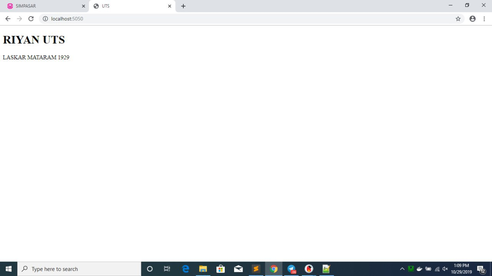

NAma : felix jefrian f f  
NIM : 175410038  
Jurusan : Teknik Informatika  
Tugas : UTS  TCC  

# Membuat Image   
## Membuat Folder  

    PS C:\Users\User> mkdir riyans  
    PS C:\Users\User> cd riyans  
## Membuat Image  

    PS C:\Users\User\riyans> docker build -t riyans/riyans:v1 .
    Sending build context to Docker daemon  3.072kB
    Step 1/2 : FROM nginx:alpine
    ---> b6753551581f
    Step 2/2 : COPY . /usr/share/nginx/html
    ---> 75955f90dc0a
    Successfully built 75955f90dc0a
    Successfully tagged riyans/riyans:v1  
## Melihat Image  

    PS C:\Users\User\riyans> docker images
    REPOSITORY                TAG                 IMAGE ID            CREATED             SIZE
    riyans/riyans             v1                  75955f90dc0a        42 seconds ago      21.4MB  
## Membuat container  

    PS C:\Users\User\riyans> docker run -d -p 5050:80 --name=mataram riyans/riyans:v1
    494cdf7be5c27bfda3a87c4d4aec6db6a0b0850219b36b2fb4d40c0273156b16  
## Melihat Container  

    PS C:\Users\User\riyans> docker ps
    CONTAINER ID        IMAGE                        COMMAND                  CREATED             STATUS              PORTS                  NAMES
    494cdf7be5c2        riyans/riyans:v1             "nginx -g 'daemon of…"   26 seconds ago      Up 24 seconds       0.0.0.0:5050->80/tcp   mataram  
## Push Ke dockerHub  

    PS C:\Users\User\riyans> docker push riyans/riyans:v1
    The push refers to repository [docker.io/riyans/riyans]
    984a80186e0f: Pushed                                                                                                    bba7d2385bc1: Mounted from alditampan69/alditampan                                                                      77cae8ab23bf: Mounted from alditampan69/alditampan                                                                      v1: digest: sha256:1c450f5ae48bc5f5b4ccee119e3a875e88bb7b314ae0d6a7ef51e11bb503577b size: 946
    PS C:\Users\User\riyans>  

## Tes Di browser  
